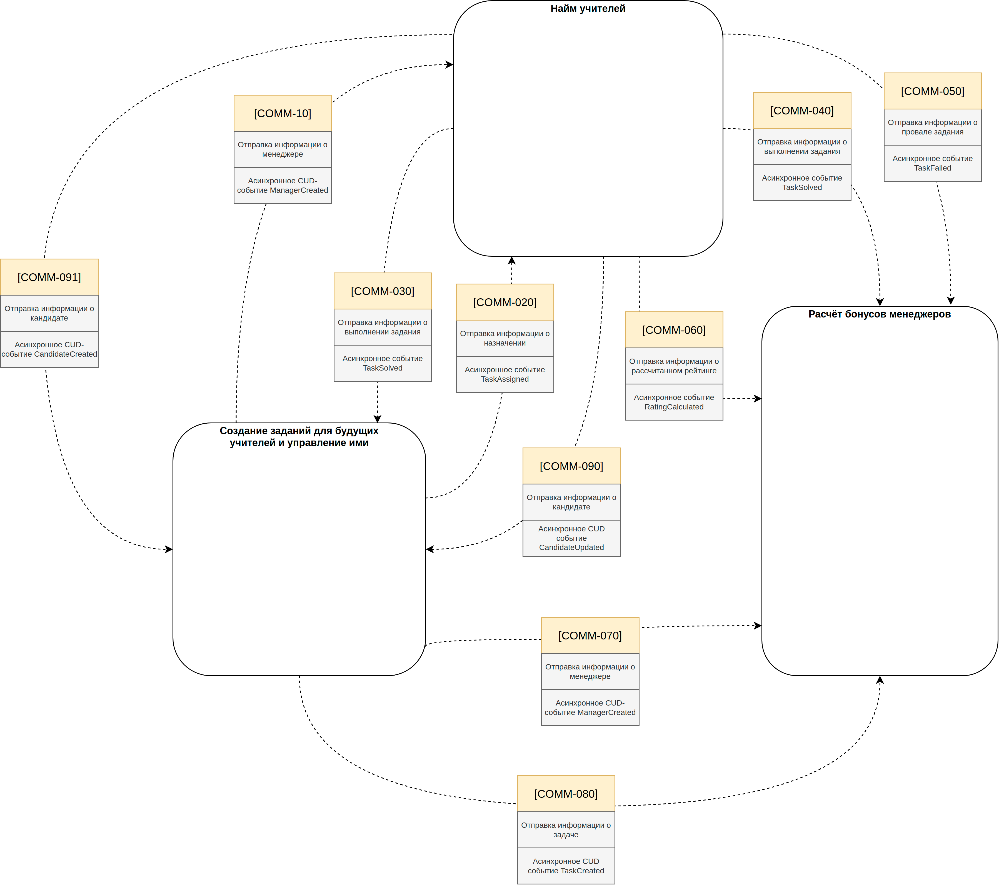

## Домашнее задание 1

### 1. Event Storming

**[Рассмотреть Event Storming поближе ↗](https://raw.githubusercontent.com/OkinawaNet/TT/refs/heads/main/image/hw_1/es.png)**

### 2. Изменения в связях

| Номер связи | Как связь сделана на текущий момент | Какая теперь будет связь | Номера проблем бизнеса | Почему связь необходимо изменить |
|:------------|:-----------------------------------|:------------------------|:------------------------|:--------------------------------|
| COMM-10 | HTTP-вызов | Асинхронное CUD-событие ManagerCreated | [Problem-060],[Problem-080], [Problem-090] | Нет необходимости завязываться на синхронный запрос и обеспечивать доставку данных. Лучше применить ED-коммуникацию. «Отправил и забыл» [Problem-60] Облегчает скейлинг, потому что входящий запрос меняется на объявление события [Problem-80] Возможно частично решится, зависит от реализации. Требует уточнения [Problem-090] Шаг в сторону решения. Не вылезаем за пределы сервиса. Публикуем событие |
| COMM-20 | HTTP-вызов | Асинхронное событие TaskAssigned | [Problem-010],[Problem-070], [Problem-080], [Problem-090] | Слать асинхронно событие о назначении в Kafka, избегая каплинга. Найм читает топик и хранит в базе потом [Problem-010] Исправляет, т.к. уже нет необходимости синхронно бегать в сервис заданий [Problem-070] Возможно частично исправит, не придется ходить за заданием в сервис заданий [Problem-080] Исправляет. ED-коммуникации позволят работать сервису без проблем в случае отвала других сервисов [Problem-090] Исправляет. ED-коммуникации избавят от протечек абстракций. Будет достаточно понимания одного сервиса |
| COMM-30 | HTTP-вызов | Асинхронное событие TaskSolved | [Problem-050], [Problem-060], [Problem-080], [Problem-090], [Problem-100] | Контрол каплинг. Информация о назначении на переделку протекает в сервис найма [Problem-050] Вероятно исправит. Не придется делать синхронный запрос в сервис заданий [Problem-060] Исправит. Асинхронные коммуникации облегчат скейлинг. Сервис сейчас читает, отправляет только события. А значит не будет проблем развернуть еще один инстанс. Каплинг низкий [Problem-080] Исправит. ED-коммуникации позволят работать сервису без проблем в случае отвала других сервисов [Problem-090] ED-коммуникации избавят от протечек абстракций. Будет достаточно понимания одного сервиса [Problem-100] ED-коммуникации на базе Kafka хранят всё в логах. Исправит |
| COMM-40 | HTTP-вызов | Асинхронное событие TaskSolved | [Problem-040], [Problem-050], [Problem-080], [Problem-090], [Problem-100] | Контрол каплинг со всеми вытекающими. Заменяем на асинхронную коммуникацию по событию TaskSolved [Problem-040] Использование Kafka позволит не перегружать сервис. А также поможет скейлить в случае необходимости [Problem-050] Асинхронные коммуникации избавят от задержек [Problem-080] ED-коммуникации позволят работать сервису без проблем в случае отвала других сервисов. Синхронных запросов из сервиса найма нет [Problem-090] ED-коммуникации избавят от протечек абстракций. Будет достаточно понимания одного сервиса [Problem-100] ED-коммуникации на базе Kafka хранят всё в логах. Исправит |
| COMM-50 | HTTP-вызов | Асинхронное событие TaskFailed | [Problem-080], [Problem-090], [Problem-100] | Контрол каплинг со всеми вытекающими. Заменяем на асинхронную коммуникацию по событию TaskFailed [Problem-080] ED-коммуникации позволят работать сервису без проблем в случае отвала других сервисов. Синхронных запросов из сервиса найма нет [Problem-090] ED-коммуникации избавят от протечек абстракций. Будет достаточно понимания одного сервиса [Problem-100] ED-коммуникации на базе Kafka хранят всё в логах. Исправит |
| COMM-60 | асинхронное событие | Асинхронное событие RatingCalculated | [Problem-030] | Есть требование актуальных данных по рейтингу. При объявлении события расчета рейтинга надо указать ID задачи. Потом в очереди входящих в бонусы событий TaskSolved ожидать событие RatingCalculated с нужным ID. Ожидающие слать в DLQ [Problem-030] Похоже, что запрос пересчета либо ждет рейтинг из топика, либо считает без него. Проблема решится |
| COMM-70 | HTTP-вызов | Асинхронное CUD-событие ManagerCreated | [Problem-060], [Problem-090] | Нет необходимости завязываться на синхронный запрос и обеспечивать доставку данных. Лучше применить ED-коммуникацию. «Отправил и забыл» [Problem-60] Облегчает скейлинг, потому что входящий запрос меняется на объявление события [Problem-090] Шаг в сторону решения. Не вылезаем за пределы сервиса. Публикуем событие |
| COMM-80 | HTTP-вызов | Асинхронное CUD событие TaskCreated | [Problem-020], [Problem-090] | Контрол каплинг. Слать асинхронно событие о создании задания, избегая контрол каплинга. Сервис бонусов читает топик и добавляет транзакцию согласно требованиям [Problem-020] Возможно будет исправлен, ибо нет контрол каплинга. Не ждем ответ от сервиса бонусов [Problem-090] ED-коммуникации избавят от протечек абстракций. Будет достаточно понимания одного сервиса |
| COMM-90 | HTTP-вызов | Асинхронное CUD событие CandidateUpdated | [Problem-090] | Каплинг, завязанный на поллинг данных. Сервис заданий зависим от сервиса найма. CUD-событие изменения типа юзера [Problem-090] ED-коммуникации избавят от протечек абстракций. Будет достаточно понимания одного сервиса |
| COMM-91 | не реализована | Асинхронное CUD-событие CandidateCreated | [Problem-090] | CUD-событие создания как часть событийной логики про кандидатов [Problem-090] ED-коммуникации избавят от протечек абстракций. Будет достаточно понимания одного сервиса |

### 3. Схема измененных связей

**[Рассмотреть схему связей поближе ↗](https://raw.githubusercontent.com/OkinawaNet/TT/refs/heads/main/image/hw_1/comm.png)**