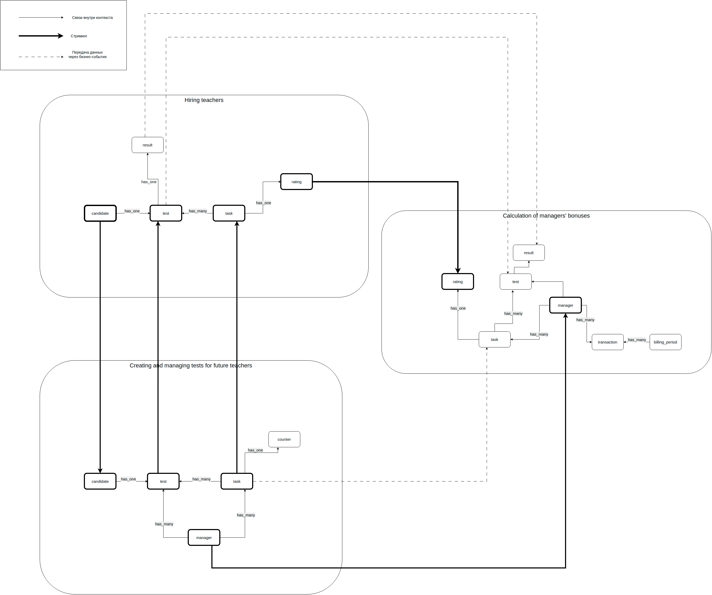
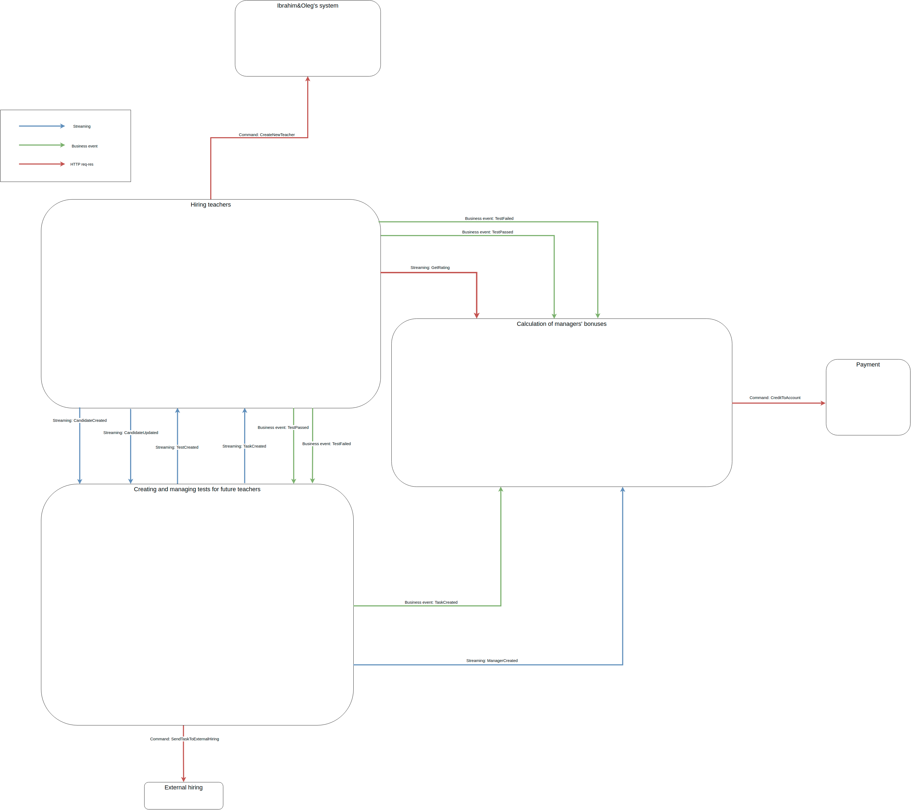

## Домашнее задание 2

### 1. Концептуальная схема данных

**[Рассмотреть схема поближе ↗](https://raw.githubusercontent.com/OkinawaNet/TT/refs/heads/main/image/hw_2/conceptual_schema.png)**

### 2. Схема измененных связей

**[Рассмотреть схему поближе ↗](https://raw.githubusercontent.com/OkinawaNet/TT/refs/heads/main/image/hw_2/communications_schema.png)**

### 3. Изменения связей

| Номер связи | Название связи | Как связь сделана на текущий момент | Как изменилась связь после первого урока | Какая теперь будет связь после второго урока | Номера проблем бизнеса, которые потенциально решатся | Почему связь необходимо изменить |
|-------------|----------------|-------------------------------------|------------------------------------------|-----------------------------------------------|-------------------------------------------------------|----------------------------------|
| COMM-10 | Получение информации о менеджере | HTTP-вызов | асинхронное CUD событие | нет связи | [Problem-060] [Problem-080] [Problem-090] | Убираем связь, в сервисе найма менеджер не нужен. [Problem-60] Облегчает скейлинг. [Problem-80] Шаг в сторону решения. [Problem-090] Шаг в сторону решения. |
| COMM-20 | Получение информации о задании | HTTP-вызов | асинхронное событие | Streaming: TaskCreated | [Problem-010] [Problem-070] [Problem-080] [Problem-090] | Слать асинхронно события о создании задачи и назначении в Kafka, избегая синхронных запросов. [Problem-010] Исправляет, т.к. уже нет необходимости синхронно бегать в сервис заданий. [Problem-070] Возможно частично исправит, не придется ходить за заданием в сервис заданий. [Problem-080] Исправляет. ED-коммуникации позволят работать сервису без проблем в случае отвала других сервисов. [Problem-090] Исправляет. ED-коммуникации избавят от протечек абстракций. Будет достаточно понимания одного сервиса. |
| COMM-21 | Получение информации о назначенном задании | нет связи | нет связи | Streaming: TestCreated |  |  |
| COMM-30 | Назначение менеджера на переделку задания | HTTP-вызов | асинхронное событие | Business event: TestPassed | [Problem-050] [Problem-060] [Problem-080] [Problem-090] [Problem-100] | Контроль каплинга. Информация о назначении на переделку протекает в сервис найма. [Problem-050] Вероятно исправит. Не придется делать синхронный запрос в сервис заданий. [Problem-060] Исправит. Асинхронные коммуникации облегчат скейлинг. Сервис сейчас читает, отправляет только события. А значит не будет проблем развернуть еще один инстанс. Каплинг низкий. [Problem-080] Исправит. ED-коммуникации позволят работать сервису без проблем в случае отвала других сервисов. [Problem-090] ED-коммуникации избавят от протечек абстракций. Будет достаточно понимания одного сервиса. [Problem-100] ED-коммуникации на базе Kafka хранят всё в логах. Исправит. |
| COMM-40 | Зачисление бонусов на счёт менеджера | HTTP-вызов | асинхронное событие | Business event: TestPassed | [Problem-040] [Problem-050] [Problem-080] [Problem-090] [Problem-100] | Контроль каплинга со всеми вытекающими. Заменяем на асинхронную коммуникацию по событию TestPassed. [Problem-040] Использование Kafka позволит не перегружать сервис. А также поможет скейлить в случае необходимости. [Problem-050] Асинхронные коммуникации избавят от задержек. [Problem-080] ED-коммуникации позволят работать сервису без проблем в случае отвала других сервисов. Синхронных запросов из сервиса найма нет. [Problem-090] ED-коммуникации избавят от протечек абстракций. Будет достаточно понимания одного сервиса. [Problem-100] ED-коммуникации на базе Kafka хранят всё в логах. Исправит. |
| COMM-50 | Списание средств со счёта менеджера | HTTP-вызов | асинхронное событие | Business event: TestFailed | [Problem-080] [Problem-090] [Problem-100] | Контроль каплинга со всеми вытекающими. Заменяем на асинхронную коммуникацию по событию TestFailed. [Problem-080] ED-коммуникации позволят работать сервису без проблем в случае отвала других сервисов. Синхронных запросов из сервиса найма нет. [Problem-090] ED-коммуникации избавят от протечек абстракций. Будет достаточно понимания одного сервиса. [Problem-100] ED-коммуникации на базе Kafka хранят всё в логах. Исправит. |
| COMM-60 | Доставка рейтинга | асинхронное событие | асинхронное событие | HTTP-вызов | [Problem-030] | Блокирующий HTTP-вызов обеспечит консистентность рейтинга. |
| COMM-70 | Получение информации о менеджере | HTTP-вызов | асинхронное CUD событие | Streaming: ManagerCreated | [Problem-060] [Problem-090] | Нет необходимости завязываться на синхронный запрос. Лучше применить ED-коммуникацию. "Отправил и забыл". Минус каплинг. [Problem-60] Облегчает скейлинг, потому что входящий запрос меняется на объявление события. [Problem-090] Шаг в сторону решения. Не вылезаем за пределы сервиса. Публикуем событие. |
| COMM-80 | Зачисление средств на счёт менеджера | HTTP-вызов | асинхронное событие | Business event: TaskCreated | [Problem-020] [Problem-090] | Контроль каплинга. Лучше слать асинхронно бизнес событие о создании задания. Сервис бонусов читает топик и добавляет транзакцию согласно требованиям. Пополняет таблицу с задачами в сервисе бонусов. [Problem-020] Возможно будет исправлен, ибо нет контроля каплинга. Не ждем ответ от сервиса бонусов. [Problem-090] ED-коммуникации избавят от протечек абстракций. Будет достаточно понимания одного сервиса. |
| COMM-90 | Получение списка кандидатов в учителя, которым будут назначаться задачи | HTTP-вызов | асинхронное событие | Streaming: CandidateUpdated | [Problem-090] | Каплинг, завязанный на поллинг данных. Сервис заданий зависим от сервиса найма. Стриминг изменения типа юзера. [Problem-090] ED-коммуникации избавят от протечек абстракций. Будет достаточно понимания одного сервиса. |
| COMM-91 |  | не реализована | асинхронное CUD событие | Streaming: CandidateCreated | [Problem-090] | Стриминг создания как часть событийной логики про кандидатов. [Problem-090] ED-коммуникации избавят от протечек абстракций. Будет достаточно понимания одного сервиса. |
| COMM-100 |  | HTTP-вызов |  | Command: CreateNewTeacher |  | Ничего не меняется. Просто обозначаем коммуникации, идущие наружу. |
| COMM-110 |  | HTTP-вызов |  | Command: CreditToAccount |  |  |
| COMM-120 |  | HTTP-вызов |  | Command: SendTaskToExternalHiring |  |  |

### 4. Топики

| Название очереди/топика       | Название событий и номеров связей, которые окажутся в топике | Почему в топике эти события | Почему так назвали |
|-------------------------------|-------------------------------------------------------------|----------------------------|--------------------|
| `data_replication.task`       | Событие `TaskCreated` (COMM-20)                             | Стриминг задач             | Стриминговые данные — `data_replication`. И через точку — сущности для репликации. |
| `data_replication.test`       | Событие `TestCreated` (COMM-21)                             | Стриминг теста (связи задача-кандидат) | — |
| `data_replication.manager`    | Событие `ManagerCreated` (COMM-70)                          | Стриминг менеджеров        | — |
| `data_replication.candidate`  | Событие `CandidateCreated` (COMM-90) Событие `CandidateCreated` (COMM-91) | Стриминг кандидатов        | — |
| `domain.test_results`         | Событие `TestPassed` (COMM-30, COMM-40) Событие `TestFailed` (COMM-50) | Топик объединяет бизнес-события, связанные с выполнением/невыполнением тестов. | Бизнес-события — `domain.test_results` — всё, связанное с результатами вступительных заданий. |
| `domain.managers_workflow`    | Событие `TaskCreated` (COMM-80)                             | Топик ведёт лог работы менеджеров. В нашем случае — только создание задач. | Бизнес-события — `domain.managers_workflow` — лог работы менеджеров. |